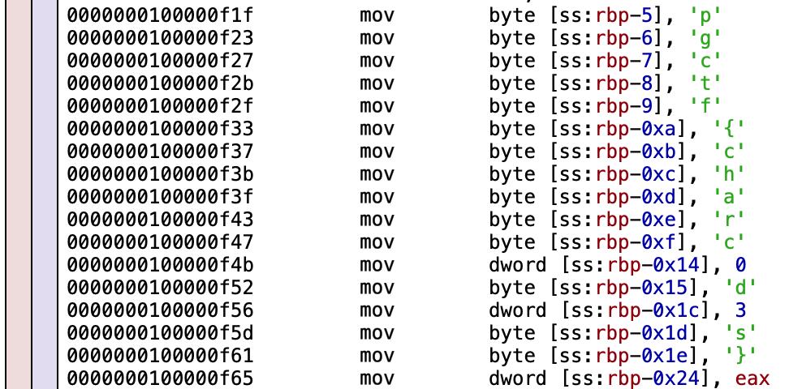

[< Go to Misc](/Misc) OR [<< Go to Home](/)
# C Me - 100 Points
## Problem
I found [moonmen walking on this binary](assets/C_me) in Rick's garage. What do you think it means?

*This is a reverse engineering problem.*

## Solution
*This problem was tested on both Windows and macOS.* \
**macOS** Tested with Hopper Decompiler (free) \
**Windows** I used an online decompiler. There may be an easier way.

---

First, open the executable in your decompiler. Look closely at the function that prints our magic term. It looks like there are a bunch of bytes that are just dangling there:

Once we properly show their values, we can see the flag:

## Flag
`pgctf{charc0d3s}`
